## Hello there, welcome to my capstone project

Eten = "essen" auf Platt.

I am in the process of developing an App which guides you through a certain amount of questions to find your desired local hamburg restaurant. Whereby I am focussing more on information which existing platforms do not always provide such as the combination of atmosphere and kitchen, size of venue and detailed outside seating.

### Loading Page

### Sign-in Page

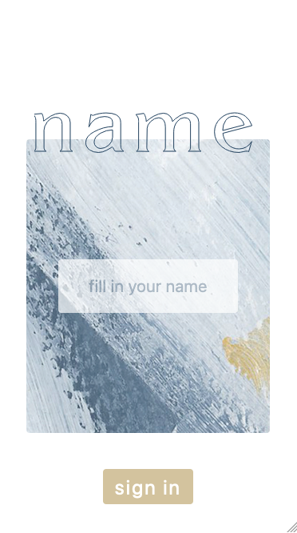

### Bookmark Page with no Restaurants saved

### Bookmark Page with Restaurants saved

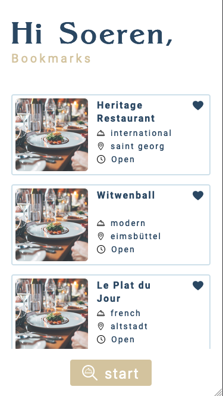

### Take Away Filter

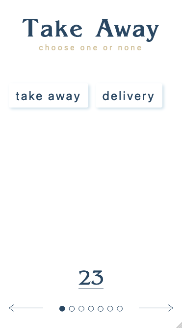

### Opening Times Filter

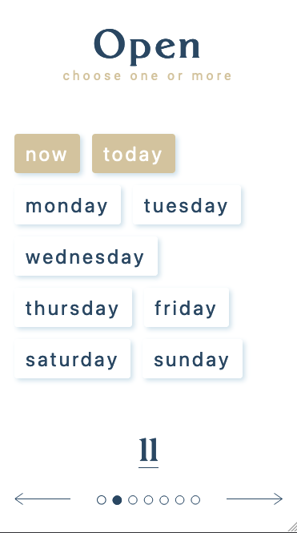

### Ambience Filter

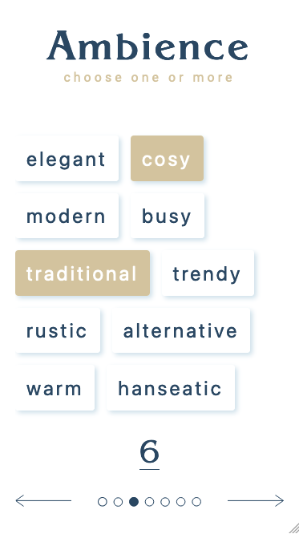

### Cuisine Filter

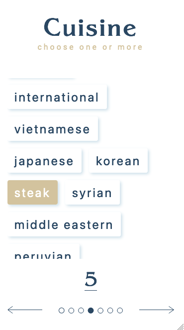

### View Filter

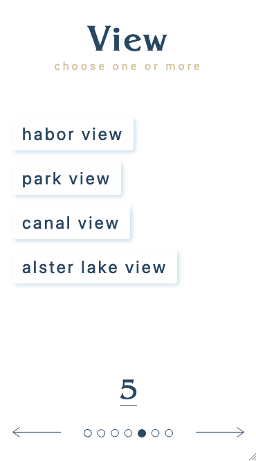

### Outdoor Filter

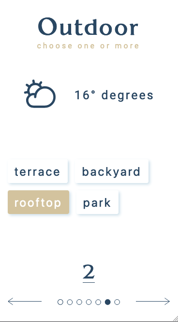

### Part of Town Filter

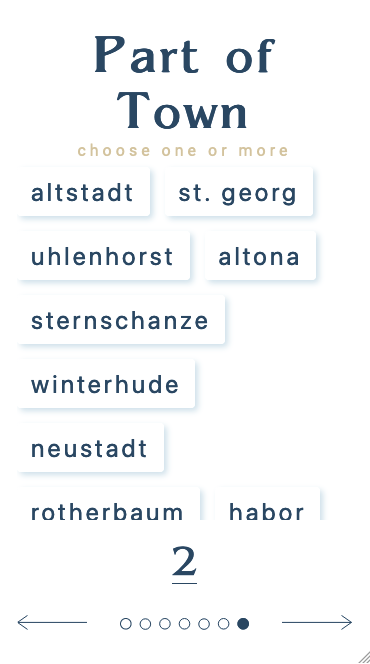

### Results Page

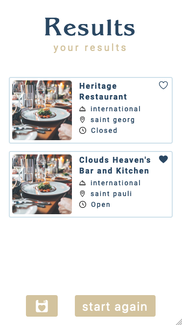

### Restaurant Detailed Page

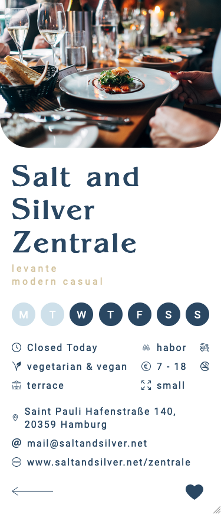
